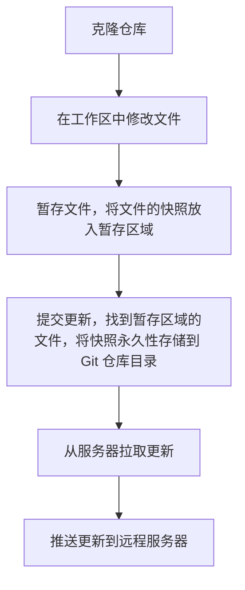

## 1. 历史版本控制系统

1. 复制整个项目目录。这样做唯一的好处是简单，但是特别容易出错，在科技发达的今天，是在是一种淘汰落后的方案。

2. 本地版本控制。其中最流行的一种叫RCS，它的工作原理是在硬盘上保存布丁集（补丁是指文件修订前后的变化）；通过应用所有的布丁，可以重新计算出各个版本的文件内容。

3. 集中化的版本控制系统。这类系统，诸如CVS、Subversion以及Perforce等，都有一个单一的集中管理的服务器，保存所有文件的修订版本，协同工作的人们都通过客户端连接到这台服务器，去除最新的文件或者提交更新。这种方式显而易见的缺点就是中央服务器的单点故障，如果宕机一小时，那么谁都无法提交更新，而且，如果中央服务器硬盘损坏，则会丢失响应数据。

4. 分布式版本控制系统。在这类系统中像Git、Mercurial、Bazaar以及Darcs等，客户端并不只是提交最新版本的文件快照，而是把代码仓库完整地镜像下来，。这么一来，任何一处协同工作的服务器发生故障，事后都可以用任何一个镜像出来的本地仓库回复。因为每一次的克隆惭怍，实际都是对代码仓库的完整备份。

## 2. Git基础原理
Git最初由Linus Torvalds（Linux之父）于2005年花了两周时间开发而成。git是一个基于c预言的被广泛使用的开发工具。

### 1. Git中文件有三种状态：

- 已修改（modified），存在于工作区
- 已暂存（staged），存在暂存区
- 已提交（committed），存在于仓库
	
### 2. 基本的 Git 工作流程：



## 3. Git配置

不同配置文件：

文件 | 功能 | 命令
    - | -  | -
	/etc/gitconfig | 对系统所有用户有效 | git config --system
	~/.gitconfig | 对当前用户有效 | git config --global
	.git/config | 当前仓库目录下的仅对该仓库有效

```bash
git config --global user.name 'aaaaaAndy'                 //配置全局用户名
git config --global user.email '980381110@qq.com'         //配置全局邮箱
git config --list                                         //查看全局配置

```


## 4. .gitignore文件的格式规范

配置 | 功能
    - | -
	# | 所有空行或者以#开头的行都会被git忽略
	*.log | 忽略所有日志文件
	/TODO | 忽略项目根目录下的TODO文件，防止递归
	.idea/ | 忽略指定的idea目录
	doc/**/*.doc | 忽略doc目录下的所有doc文件
	！| 忽略置顶模式以外的文件或目录

## 5. git常用操作

### 1. 建立本地仓库与远程仓库链接

```bash
git init				// 初始化工程.git目录
git add .				// 添加所有文件到暂存区，也可单独指定文件添加
git commit -m 'xxx'			// 提交暂存区文件问本地仓库
git remote add origin git@github.xxx	// 建立关联
git push -u origin master  		// 将本地仓库的文件推送到远程仓库 
```

```bash
git clone git@github.xxx	// clone之后本地仓库与远程仓库已经建立了连接，可直接提交代码
```

### 2. 提交代码

```bash
git add .			// 添加所有文件到暂存区，也可单独指定文件添加
git commit -m 'xxx'		// 提交暂存区文件问本地仓库
git pull			// 从远程仓库拉下最新代码
git push			// 将本地仓库文件推送到远程仓库
```

### 3. 新建与切换分支

```bash
git branch			// 查看当前分支
git checkout xxx		// 切换分支
git checkout -b xxx 		// 新建并切换到该分支
git push -u origin xxx		// 将新建分支推送远程仓库
```

### 4. 合并代码

如果将B分支代码合并到A分支上

```bash
git checkout xxx		// 先切换A分支上
git merge vvv			// 将B分支代码合并到A分支上
git push			// 将本地代码推送到远程分支
```

### 5. 删除本地或远程分支

```bash
git push origin –-delete dev 	// 删除远程分支
git push origin -d dev          // 删除远程分支

git branch -d dev 		//删除本地分支
```

### 6. 撤销操作（Push到远程仓库之前）

```bash
// 只修改，未add
git checkout .							// 撤销所有的修改
git checkout -- 文件         // 撤销未add的文件修改，红字变无

// 已add未commit
git reset HEAD .            // 撤销所有的已经add的文件
git reset HEAD -filename    // 撤销某个文件或文件夹

// 已commit未push
git reset --hard HEAD^      // 回退内容到上一次提交
git reset --hard commit-id  // 回退内容到指定的提交
```

### git reset的参数问题

```bash
// 回退一个版本,且会将暂存区的内容和本地已提交的内容全部恢复到未暂存的状态,不影响原来本地文件(未提交的也不受影响)
git reset (-–mixed) HEAD~1

// 回退一个版本,不清空暂存区,将已提交的内容恢复到暂存区,不影响原来本地的文件(未提交的也不受影响)
git reset -–soft HEAD~1

// 回退一个版本,清空暂存区,将已提交的内容的版本恢复到本地,本地的文件也将被恢复的版本替换
git reset -–hard HEAD~1
```

### 7. 回滚操作（已经push到远程仓库）

* 方法一：使用revert
revert是放弃指定提交的修改，但是会生成一次新的提交，需要填写提交注释，以前的历史记录都在；

```bash
git revert HEAD             // 撤销前一次提交
git revert HEAD^            // 撤销前前一次提交
git revert commit-id        // 撤销指定的提交

git push origin master
```

* 方法二：使用reset
reset是指将HEAD指针指到指定提交，历史记录中不会出现放弃的提交记录。

```bash
git reset --hard HEAD^      // 回退内容到上一次提交
git reset --hard commit-id  // 回退内容到指定的提交


git push origin master -f
```

<!-- more -->
